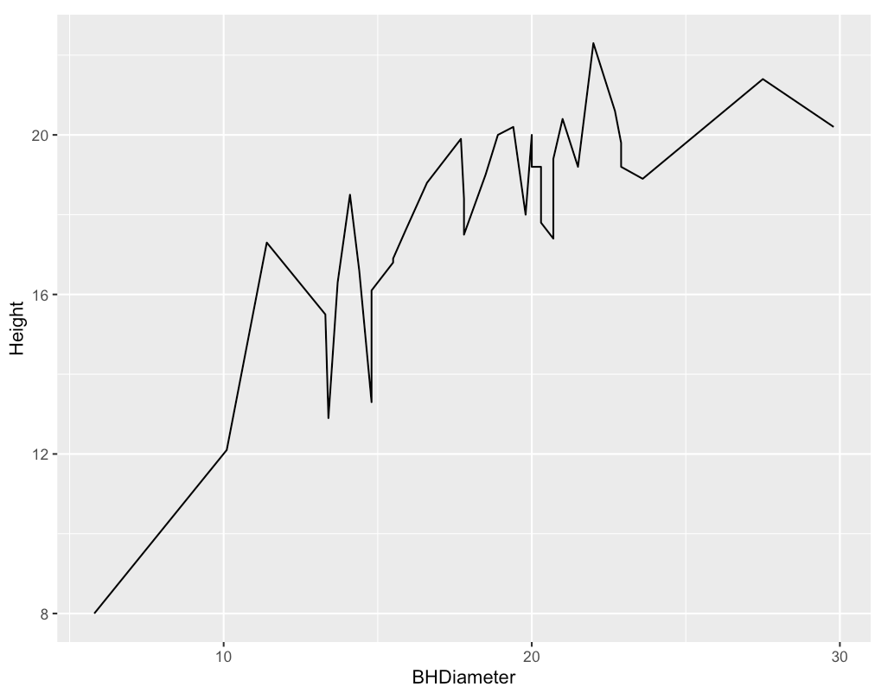
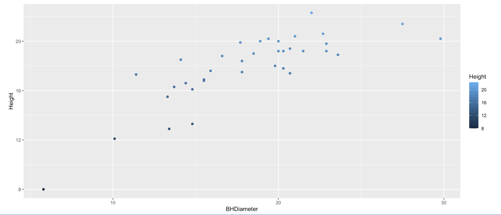
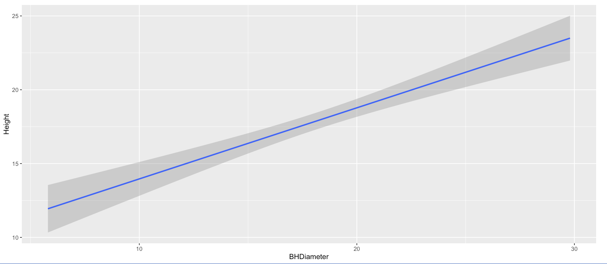

```{r setup, include=FALSE}
knitr::opts_chunk$set(echo = TRUE)
```

# Task 1
Working Directory
```{r}
getwd()
```

# Task 2
Read SPRUCE.csv
```{r}
spruce.df = read.csv("SPRUCE.csv")
head(spruce.df)
```


# Task 3 :
## Make a scatter plot to view the relationship between Tree Height and BHDiamenter
```{r}
plot(Height~BHDiameter , bg ="Blue", pch =21,cex= 1.2,xlim=c(0,max(BHDiameter)*1.1), ylim=c(0,max(Height)*1.1), xlab= "Breast Height Diameter (cm)",ylab = "Height of the Tree (m)", main = "Tree Height vs BHDiameter", spruce.df)

```
## Does there appear to be a straight line relationship?
By looking at the graph, we can see a straight-line pattern emerging on the right side. However, on the left side, the data points deviate from a straight line, suggesting that the data would be better represented by a curve rather than a linear fit.

## Trendscatter plots f=(0.5, 0.6, 0.7)
```{r}
library(s20x)
layout(matrix(1:3 ,nrow =1, ncol = 3,byrow = TRUE))
trendscatter(Height~BHDiameter, f=0.5, spruce.df)
trendscatter(Height~BHDiameter, f=0.6, spruce.df)
trendscatter(Height~BHDiameter, f=0.7, spruce.df)
```
## Make a linear model object, call it spruce.lm 
```{r}
spruce.lm = lm(Height~BHDiameter,spruce.df)
#summary(spruce.lm)
```

## New Scatter plot with the least squares regression line
```{r}
plot(Height~BHDiameter , bg ="Blue", pch =21,cex= 1.2,xlim=c(0,max(BHDiameter)*1.1), ylim=c(0,max(Height)*1.1), xlab= "Breast Height Diameter (cm)",ylab = "Height of the Tree (m)", main = "Tree Height vs BHDiameter", spruce.df)
abline(spruce.lm)
```
## Comment on the graph, is a straight line appropriate? Consider the smoother curve also.
A straight line does not adequately represent this graph, as the trend scatter plots reveal the curvature more effectively for all three f-values.

# Task 4

## Divide the graphical interface into 4 equal areas, use layout.show(4) and record the picture.
```{r}
layout(matrix(1:4 ,nrow =2, ncol = 2,byrow = TRUE))

layout.show(4)
```
```{r}
layout(matrix(1:4, nrow = 2, ncol = 2, byrow = TRUE))

plot(Height~BHDiameter , bg ="Blue", pch =21,cex= 1.0,xlim=c(0,max(BHDiameter)*1.1), ylim=c(0,max(Height)*1.1), xlab= "Breast Height Diameter (cm)",ylab = "Height of the Tree (m)", main = "Fitted", spruce.df)
abline(spruce.lm)

yhat = predict(spruce.lm, data.frame(BHDiameter = spruce.df$BHDiameter))

yhat= fitted(spruce.lm)

plot(Height~BHDiameter , bg ="Blue", pch =21,cex= 1.0,xlim=c(0,max(BHDiameter)*1.1), ylim=c(0,max(Height)*1.1), xlab= "Breast Height Diameter (cm)",ylab = "Height of the Tree (m)", main = "RSS", spruce.df)

with(spruce.df,{segments(BHDiameter, Height, BHDiameter, yhat)})
abline(spruce.lm)

# mean and model line segment
plot(Height~BHDiameter , bg ="Blue", pch =21,cex= 1.0,xlim=c(0,max(BHDiameter)*1.1), ylim=c(0,max(Height)*1.1), xlab= "Breast Height Diameter (cm)",ylab = "Height of the Tree (m)", main = "MSS", spruce.df)

with(spruce.df, abline(h = mean(Height)))
with(spruce.df, segments(BHDiameter, mean(Height), BHDiameter, yhat, col = "red"))
abline(spruce.lm)


# mean and total deviation 
plot(Height~BHDiameter , bg ="Blue", pch =21,cex= 1.0,xlim=c(0,max(BHDiameter)*1.1), ylim=c(0,max(Height)*1.1), xlab= "Breast Height Diameter (cm)",ylab = "Height of the Tree (m)", main = "TSS", spruce.df)

with(spruce.df, abline(h = mean(Height)))
with(spruce.df, segments(BHDiameter, Height, BHDiameter, mean(Height), col = "green"))
```


## Calculate TSS, MSS and RSS
### TSS
```{r}
# Total sum of squares 
TSS = with (spruce.df, sum((Height - mean(Height))^2))
TSS
```

### MSS
```{r}
#Model of sum of squares
MSS = with (spruce.df, sum((yhat - mean(Height))^2))
MSS
```

### RSS
```{r}
# Residual sium of squares 
RSS = with (spruce.df, sum((Height - yhat)^2))
RSS
```

## Calculate MSS/TSS, and interpret it!
```{r}
MSS/ TSS
```
The value of 0.6570, obtained by dividing MSS by TSS, indicates a relatively high proportion of variability explained by the model. However, this suggests that a straight line does not provide the best fit for this data.

## Does TSS=MSS+RSS?
```{r}
MSS+RSS
```
Yes, MSS+RSS equal TSS.

# Task 5
## Summarize spruce.lm paste it here.
```{r}
summary(spruce.lm)
```
```{r}
coef(spruce.lm)
```

## Slope
slope = 0.4814743

## Intercept
Intercept = 9.1468390

## Equation of the fitted line.
$$
 Height = β_0 + β_1x. 
$$
$$
 Height = 9.1468+0.4815x
$$
formula for R^2
$$
R^2 = MSS/TSS
$$
## 	Predict the Height of spruce
```{r}
predict(spruce.lm, data.frame(BHDiameter =c(15,18,20)))
```

# Task 6
```{r}
library(ggplot2)
g=ggplot(spruce.df, aes(x=BHDiameter,y=Height,color=BHDiameter))
g=g+geom_point() + geom_line()+ geom_smooth(method="lm")
g+ggtitle("Tree Height vs Breast Height Diameter - Shone Renjan")
```

# Task 7
This is how you place images in RMD documents

<center>
{ width=70% }
{ width=70% }
{ width=70% }


</center>


